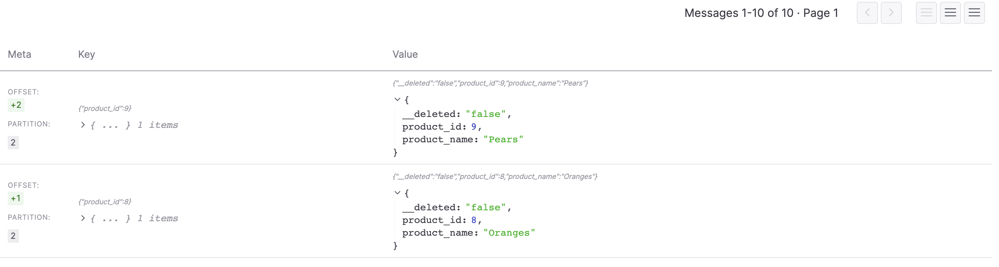

# Aiven Postgres to S3 Demo Instructions

## Introduction

The purpose of this demo is to show flow of data from Postgres to Parquet files on S3 via CDC capture using Debezium and the Aiven [Kafka to S3](https://docs.aiven.io/docs/products/kafka/kafka-connect/howto/s3-sink-connector-aiven) integration. We will set up the demonstration using the [Aiven Terraform provider](https://registry.terraform.io/providers/aiven/aiven/latest/docs).

# Setup

Clone this project

```bash
git clone git@github.com:ken-tune/aiven-pg-to-s3-demo.git
cd aiven-pg-to-s3-demo
```

### Pre-requisites

Install 

The [aws command line utility](https://docs.aws.amazon.com/cli/latest/userguide/getting-started-install.html)

[Parquet tools](https://pypi.org/project/parquet-tools/)

Postgres Client - instructions [here](https://www.timescale.com/blog/how-to-install-psql-on-mac-ubuntu-debian-windows/)

### Aiven login token

An Aiven token is required in order to use the Terraform client. Obtain a token using [these instructions](https://docs.aiven.io/docs/platform/howto/create_authentication_token).

To store the token

```bash
cp aivenToken.sh.template aivenToken.sh	
```

Edit the file to include your token. It should read something like

```bash
# Add your Aiven token below

export TF_VAR_aiven_api_token=mDKaOFyOuRLx59316mWC4k+KTHQEe8
...
0iQfIT9rEde8wbkKoSjeoEHReBPYTbGZ5NUyjftWKjjvS+LJ7Z4+ECC+KYM=
```

### S3 Setup

Create an S3 bucket. Create a user and assign the policy in `useful/s3.policy.json` to that user, having changed the value of YOUR_BUCKET. Obtain the access key id and secret access key for this user.

### User specific data

The Aiven project deployed into will be specific to the user of this demo. We will also allow the user to set a specific password for all resources to make life easy for demo purposes. 

We also need to add our S3 credentials - the user access key & secret access key as well as the bucket name and its region

To do this

```bash
cp userSpecific.sh.template userSpecific.sh 
```

and edit the file as required.	

```
AIVEN_PROJECT=your_aiven_project_name
AIVEN_SERVICE_PASSWORD=my_secret_password

AWS_ACCESS_KEY_ID=your_aws_access_key
AWS_SECRET_ACCESS_KEY=your_aws_secret_access_key
AWS_S3_BUCKET_NAME=your_s3_bucket_name
AWS_S3_REGION=your_s3_region
```

## Service Setup

```
./serviceSetup.sh
```

This will set up Kafka, Postgres, Kafka Connect - visible as *aiven-demo-kafka, aiven-demo-postgres, aiven-demo-kafka-connect* in the Aiven console.

There will be a Debezium connector using CDC to capture Postgres update events into Kafka (*kafka-pg-source*)

There will be an S3 connector to write the update events from Kafka into your S3 bucket (*kafka-s3-sink*)

## Data Flow

Having set up the project you are now in a position to see data flow through the system. Run

```
./pgClient.sh -f testSQL/01_BasicInsert.sql
```
which inserts 10 rows, to the products table (examples below)

```
+--------------+----------------+
|   product_id | product_name   |
|--------------+----------------+
|            1 | Ham            |
|            2 | Eggs           |
|            3 | Cheese         |
...
```


If you access the messages in the automatically created *replicator.demo.products* topic in Kafka you should see something similar to the following



Using the AWS CLI you can inspect the contents of your S3 bucket. It should look something like the below.

```bash
(venv) ken.tune images> aws s3 ls s3://ken.tune.aiven                            
2024-01-16 10:44:25       1124 replicator.demo.products-0-0.gz
2024-01-16 10:44:26       1141 replicator.demo.products-1-0.gz
2024-01-16 10:44:27       1137 replicator.demo.products-2-0.gz
```

You can use parquet-tools to inspect these files. For example

```bash
(venv) ken.tune images> parquet-tools show s3://ken.tune.aiven/replicator.demo.products-0-0.gz
+--------------+----------------+-------------+
|   product_id | product_name   | __deleted   |
|--------------+----------------+-------------|
|            1 | Ham            | false       |
|            5 | Lettuce        | false       |
|            6 | Peppers        | false       |
+--------------+----------------+-------------+

```

## Other Configuration

There are a number of additional configuration changes that can be made

The service prefix (aiven-demo by default) is set in env.sh as `SERVICE_NAME_PREFIX`

The various plan sizes are set in `stage-01/terraform.tfvars` . The default configuration is below.

```
# Plan Sizes
#------------------------
service_plan_kafka = "business-4"
service_plan_kafka_connect = "business-4"
service_plan_pg = "business-4"
```

Any valid plan value can be used.

The cloud / region deployed to is set via ```service-cloud``` in `stage-01/terraform.tfvars`. The default is `google-europe-west2` . This can be set to any valid value

```
# Cloud
#------------------------
service_cloud = "google-europe-west2"
```

## Service Removal

Run

```
./serviceDestroy.sh
```

to remove the services.


